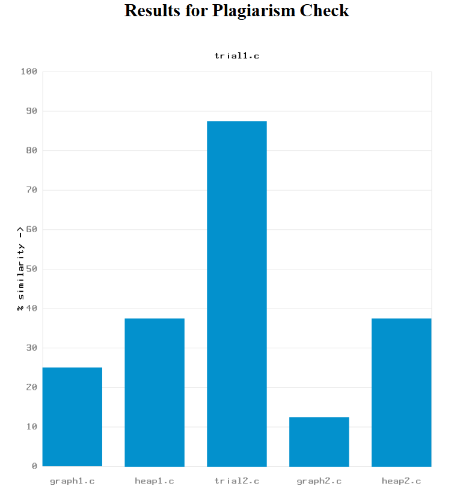
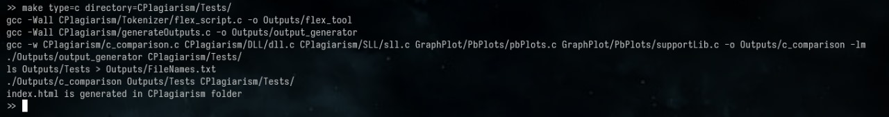

[![Contributors][contributors-shield]][contributors-url] [![MIT License][license-shield]][license-url]

<h1 align="center">Plagiarism Detector</h1>
<p align="center" style="font-weight:600;font-size:20px;margin-bottom:20px">
    Plagiarism Checker for .c and .txt files built using C Programming Language.
</p>

<!-- ###### Part of the DSA Mini-Project Submission for COEP Tech. -->

<br />
<div align="center">
  <a href="https://github.com/othneildrew/Best-README-Template">
    
  </a>
  <p align="center" style="font-weight:500;font-size:18px">
    A C-based plagiarism detection tool that efficiently compares text files to identify similarities with the extensive use of different Data Structures and Algorithms. It ensures accurate and fast detection, making it ideal for academic and professional use.
    <br />
    <br />
    <a href="./assets/index.html">View Demo</a>
    ·
    <a href="#ContactUs">Report Bug</a>
    ·
    <a href="#ContactUs">Request Feature</a>
  </p>
</div>

<!--TABLE OF CONTENTS-->
<details>
  <summary>Table of Contents</summary>
  <ol>
    <li>
      <a href="#about-the-project">About The Project</a>
      <ul>
        <li><a href="#built-with">Built With</a></li>
      </ul>
    </li>
    <li>
      <a href="#getting-started">Getting Started</a>
      <ul>
        <li><a href="#prerequisites">Prerequisites</a></li>
        <li><a href="#installation">Installation</a></li>
      </ul>
    </li>
    <li><a href="#usage">Usage</a></li>
    <li><a href="#license">License</a></li>
    <li><a href="#contact_Contributors">Contact</a></li>
    <li><a href="#acknowledgments">Acknowledgments</a></li>
  </ol>
</details>

<!-- ABOUT THE PROJECT -->

## About The Project




**This is a CLI tool built using C with the use of Various Data Structures and Algorithms**. It is a part of the DSA Mini Project (OddSem 24-25). As of now the tool support Plagiarism Checking for .c and .txt and .pdf files only.
Support for other types of files can be added with the relevant grammar for the corresponding language.
**List of Data Structures Used --**

- Singly Linked List
- Doubly Linked List
- Binary Search Tree
- Arrays
- Stack
- Custom Pair DataStructure for Efficient Memory Management

**List of Algorithms Used --**

- N-gram Similarity Algorithm for .txt Files
- Modified Sim-Utiliy Algorithm & JPlag for .c Files

### Features:

1. **Free and Open Source**: Distributed under the permissive MIT License, fostering collaboration and innovation.
2. **Intuitive Result Visualization**: Presents results as interactive graphs rendered in an HTML file for easy analysis.
3. **PDF File Support**: Includes a precise and reliable PDF parser for seamless comparison of text within PDF documents.
4. **Batch File Comparison**: Allows comparison across multiple files or entire directories for comprehensive analysis.
5. **Bidirectional Similarity Check**: Generates results for both directions— 1-to-2 similarity and 2-to-1 similarity—for thorough detection.
6. **Fast and Accurate**: Delivers results quickly and with high precision, rivalling leading plagiarism detection tools.

This tool offers a robust and user-friendly solution for all plagiarism detection needs.

### Built With

The Major Programming Languages/Libraries Used are :

- C Programming Language
- Flex Tool for Efficient Tokenization
- Poppler Library for PDF Parsing
- PbPlot Library for Graph Plotting and Result Visualization


## Getting Started

This is an example of how you may give instructions on setting up your project locally.
To get a local copy up and running follow these simple example steps.

### Prerequisites

This is an example of how to list things you need to use the software and how to install them.

- Flex-Tool Installation for Debian based Systems.
```sh
  sudo apt install flex
```  

  For other Linux Distros, use the corresponding package manager

### Installation

Below is an example of how you can instruct your audience on installing and setting up your app. This template doesn't rely on any external dependencies or services.

1. Clone the repo
   ```sh
   git clone https://github.com/HardikMutha/Plagiarism_Detection_Using_C.git
   cd ./Plagiarism_Detection_Using_C/
   ```
   
2. Install poppler Library

   ```sh
    sudo apt install libpoppler-dev
   ```

   <p align="right">(<a href="#readme-top">back to top</a>)</p>

<!-- USAGE EXAMPLES -->

## Usage

Use **MakeFile** to run the Project.
The type parameter should either be **c** or **txt** depending upon the type of file being checked.
The Directory parameter should specify the directory of the files to be checked.

  ```sh
    make type=c/txt directory=directoryname
  ```

#### Example

If the type of the files being checked is **C** and the files are located in **~/CPlagiarism/Tests/**, then command should look like,

  ```sh
    make type=c directory=  ~/CPlagiarism/Tests/
  ```

Expected Output -

**The resultant index.html file contains the results in the form of bar-graphs.**

<p align="right">(<a href="#readme-top">back to top</a>)</p>

[contributors-shield]: https://img.shields.io/badge/Contributors-3-blue
[contributors-url]: https://github.com/HardikMutha/Plagiarism_Detection_Using_C/graphs/contributors
[license-shield]: https://img.shields.io/badge/License-MIT-green
[license-url]: https://github.com/othneildrew/Best-README-Template/blob/master/LICENSE.txt
[product-screenshot]: ./assets/PointerDiagram.jpeg

<!-- LICENSE -->

## License

Distributed under the MIT License. See LICENSE.txt for more information.

<p align="right">(<a href="#readme-top">back to top</a>)</p>

<!-- CONTACT -->

## <u>Contact_Contributors</u>

**[Hardik Mutha](https://github.com/HardikMutha)**
<br>
**[Tanmay Karad](https://github.com/karad-tanmay)**
<br>
**[Suswan Joglekar](https://github.com/suswanj)**

#### Project Link: [Plagiarism_Detection_Using_C](https://github.com/HardikMutha/Plagiarism_Detection_Using_C)

<p align="right">(<a href="#readme-top">back to top</a>)</p>

<!-- ACKNOWLEDGMENTS -->

## Acknowledgments

We would like to express great thanks to the following resources which greatly helped us to design and build our Project :

- PDF Parser - [Poppler Library](https://gitlab.freedesktop.org/poppler/poppler)
- Graph Plotting- [pbPlots by Inductive_Computer_Science](https://github.com/InductiveComputerScience/pbPlots)
- [JPlag Research Paper](https://www.researchgate.net/publication/2832828_Finding_Plagiarisms_among_a_Set_of_Programs_with_JPlag)
- [Sim-Utility](https://www.researchgate.net/publication/221538300_Sim_A_utility_for_detecting_similarity_in_computer_programs)
- [N-gram Based Text Categorization](https://www.researchgate.net/publication/2375544_N-Gram-Based_Text_Categorization)
- Special Mention to our friend <a href="https://github.com/Mehmood-Deshmukh">Mehmood Deskmukh</a> for helping out with PDF Parser

<p align="right">(<a href="#readme-top">back to top</a>)</p>
